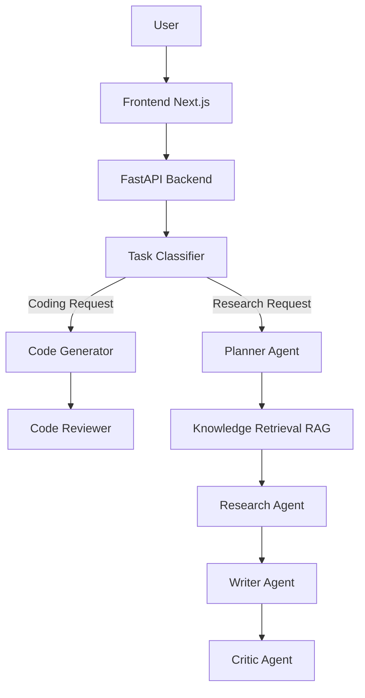

# 🧠 Agentic AI Platform – Multi-Agent Research & Coding Assistant

A production-style Agentic AI platform that combines multi-agent reasoning, RAG (Retrieval Augmented Generation), code generation, and automated code review into a single intelligent system.

The system can:
- Research topics using web search + document knowledge base
- Generate code
- Review and improve user code like a senior developer
- Cache responses for fast performance
- Show agent execution and system metrics in a modern UI

Built with FastAPI, LangGraph, Next.js, Redis, and local LLMs.

## 🌐 Live Demo
| Component | URL |
|---|---|
| Frontend | https://agentic-ai-multiple-agent.vercel.app |
| Backend API | https://agentic-ai-multiple-agent.onrender.com |


## 🚀 Features

### 🤖 Multi-Agent Architecture
The system uses specialized AI agents:
- **Task Classifier Agent** – detects whether the task is research or coding
- **Planner Agent** – breaks tasks into logical steps
- **Knowledge Agent (RAG)** – retrieves relevant document chunks
- **Research Agent** – performs web searches
- **Writer Agent** – synthesizes final answers
- **Critic Agent** – evaluates answer quality
- **Code Generator Agent** – generates production-ready code
- **Code Reviewer Agent** – performs senior-level code review

### 🔎 Hybrid RAG Knowledge Retrieval
Combines:
- Vector search
- Keyword search
- Reranking
to retrieve the most relevant knowledge.

Supports:
- PDF ingestion
- Document chunking
- Embeddings
- Vector database storage

### 💻 AI Code Generation & Review
The platform acts like an AI developer assistant.

**Capabilities:**
- Generate code from prompts
- Review user code
- Detect bugs
- Suggest improvements
- Rewrite code following best practices

**Example:**
```python
def factorial(n):
    result = 1
    for i in range(n):
        result *= i
    return result
```
**Reviewer output:**
Detects logic error (`range(1, n+1)` instead of `range(n)`), suggests improvements, and returns corrected production-quality code.

### ⚡ Redis Caching
To reduce latency the system caches:
- final answers
- web search results
- knowledge retrieval results

**Benefits:**
- Faster repeated queries
- Reduced LLM calls

### 📊 Agent Observability Dashboard
The UI tracks system performance:
- total requests
- cache hit rate
- RAG usage rate
- average latency
- agent execution time

Example telemetry:
- Planner Time: 0.4s
- Retrieval Time: 0.3s
- Writer Time: 2.1s
- Critic Time: 0.6s

### 🎨 Premium UI
Frontend built with Next.js + TailwindCSS featuring:
- glassmorphism interface
- animated background gradients
- modern AI chat UI
- agent execution visualization
- code block formatting
- responsive layout

## 🏗 System Architecture


## ⚙️ Tech Stack

**Backend**
- Python
- FastAPI
- LangGraph
- ChromaDB
- Redis
- Sentence Transformers

**Frontend**
- Next.js
- React
- Tailwind CSS
- Framer Motion
- Lucide Icons

**AI**
- Local LLM via LM Studio
- Models supported: Gemma, Mistral, Llama, Nemotron (OpenRouter)

## 📂 Project Structure
```text
backend/
│
├── agents/             # Research & General Agents
│   ├── planner_agent.py
│   ├── research_agent.py
│   ├── writer_agent.py
│   └── critic_agent.py
│
├── code_agents/        # Technical & Coding Agents
│   ├── code_generator_agent.py
│   ├── code_reviewer_agent.py
│   └── task_classifier.py
│
├── rag/                # Hybrid Retrieval Knowledge Base
│   ├── document_loader.py
│   ├── chunker.py
│   ├── hybrid_retriever.py
│   └── reranker.py
│
├── cache/              # Performance Acceleration
│   └── redis_cache.py
│
├── workflow/           # System Graph Logic
│   └── agent_graph.py
│
└── api/                # REST Server
    └── main.py


frontend/
│
├── components/         # UI Elements
│   ├── ChatWindow.tsx
│   ├── MessageBubble.tsx
│   ├── QueryInput.tsx
│   └── MetricsDashboard.tsx
│
└── app/page.tsx        # Main Application Interface
```

## ▶️ Running the Project

**1️⃣ Clone Repository**
```bash
git clone https://github.com/yuganter98/Agentic-AI-Multiple-Agent.git
cd Agentic-AI-Multiple-Agent
```

**2️⃣ Install Backend Dependencies**
```bash
cd backend
pip install -r requirements.txt
```

**3️⃣ Setup Environment Variables**
Copy the template `.env.example` to `.env` and configure your keys:
```bash
cp .env.example .env
```
Key configurations:
- `OPENROUTER_API_KEY`: Required for OpenRouter LLMs
- `TAVILY_API_KEY`: Required for web search
- `REDIS_URL`: Required for caching (e.g., Upstash or local Redis)

**4️⃣ Start Redis** (Local)
Using Docker:
```bash
docker run -p 6379:6379 redis
```

**5️⃣ Start Local LLM** (Optional)
Run a model using LM Studio and enable the API server.

**6️⃣ Start Backend**
```bash
uvicorn api.main:app --reload
```
Backend runs at: `http://localhost:8000`

**7️⃣ Start Frontend**
```bash
cd ../frontend
npm install
npm run dev
```
Open: `http://localhost:3000`

## ☁️ Deployment

### Render (Backend)
1. Create a **Web Service**.
2. Connect your GitHub repository.
3. Select **Python** runtime.
4. Set Build Command: `pip install -r requirements.txt`
5. Set Start Command: `uvicorn api.main:app --host 0.0.0.0 --port $PORT`
6. Add Environment Variables (see `.env.example`).

### Railway (Backend)
1. Create a **New Project** → **Deploy from GitHub**.
2. Railway will automatically detect the **Procfile** and **runtime.txt**.
3. Add Environment Variables in the **Variables** tab.
4. Ensure `PORT` variable is automatically assigned by Railway.

### Vercel (Frontend)
1. Connect GitHub repo.
2. Set Environment Variable: `NEXT_PUBLIC_API_URL` to your backend URL.
3. Deploy.

## 🧪 Example Usage

**Research Query**
> What is the difference between RTX 3090 and Titan RTX?

System will retrieve knowledge, search web, and generate final answer.

**Code Generation**
> Write a Python function to check if a number is prime

**Code Review**
Paste code:
```python
def factorial(n):
    result = 1
    for i in range(n):
        result *= i
    return result
```
The system will detect bugs, suggest improvements, and return corrected code.

## ⭐ Advantages
- **Multi-Agent Reasoning:** Agents specialize in different tasks, improving answer quality.
- **Hybrid Knowledge Retrieval:** Combines multiple retrieval strategies for better accuracy.
- **Developer Assistant Capabilities:** Acts as an AI coding assistant capable of generating, reviewing, and improving code.
- **High Performance:** Optimizations include Redis caching, reduced LLM calls, and parallel retrieval.
- **Observability:** Built-in metrics help monitor system performance.

## 📈 Future Improvements
Potential upgrades:
- code execution sandbox
- multi-file code analysis
- GitHub pull request reviewer
- real-time token streaming
- vector database scaling

## 👨‍💻 Author
Built as a full-stack AI platform project demonstrating multi-agent system design, RAG architecture, AI developer tools, and modern frontend UI.
